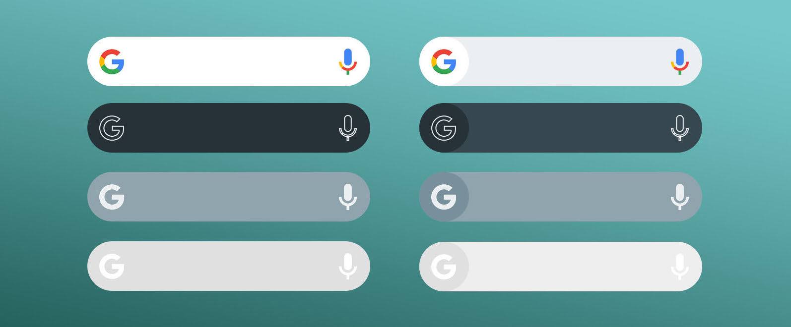
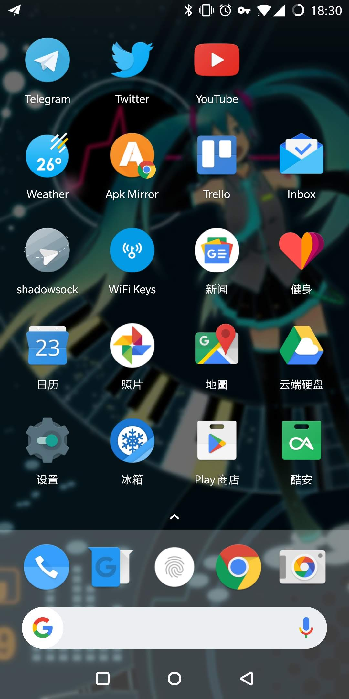

# Pixel Bar

A pixel search bar like widget.

## Download

Check [releases](https://github.com/kaedea/pixel-bar/releases).

## Screenshot

## License

The project is [Apache License, Version 2.0](/LICENSE) licensed.